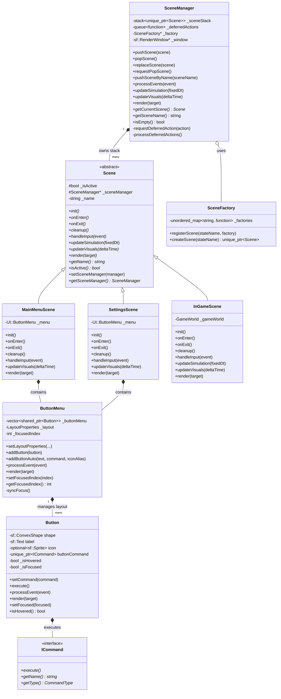

# 01: Scene Management & UI Subsystem

This document covers the **Scene Management Architecture** and the **UI Component System**.

---

## Subsystem Overview

The scene management system handles screen states (e.g., Main Menu, Gameplay, Settings) and transitions between them. It employs the **State Pattern** combined with a **Scene Stack** (`std::stack`) to support overlaid scenes (such as pause menus).

The UI subsystem provides accessible, keyboard/mouse navigable menu components (`UI::Button` and `UI::ButtonMenu`) bound to execution actions using the **Command Pattern**.

---

## Class Diagram

---

## Key Classes & Responsibilities

| Class | Type | Responsibility |
| :--- | :--- | :--- |
| `Scene` | Abstract Base | Defines lifecycle (`init`, `onEnter`, `onExit`, `cleanup`) and frame loop methods (`handleInput`, `updateSimulation`, `updateVisuals`, `render`). |
| `SceneManager` | Stack Owner & Orchestrator | Manages the active scene stack, forwards event/update/render calls to the top scene, and executes deferred scene switching safely. |
| `SceneFactory` | Registry / Factory | Decouples scene switching logic from concrete scene classes using factory lambdas indexed by string keys. |
| `MainMenuScene` | Concrete Scene | Controls the main menu UI, title display, and navigation commands. |
| `InGameScene` | Concrete Scene | Holds the `GameWorld` instance, runs gameplay simulation, and handles in-game pause/HUD overlay logic. |
| `SettingsScene` | Concrete Scene | Provides audio, debug toggle, and game setting controls via `ButtonMenu`. |
| `UI::Button` | UI Component | Individual rounded button with hover/focus states, text label, optional icon sprite, and attached `ICommand`. |
| `UI::ButtonMenu` | UI Layout Manager | Manages a list of `UI::Button` instances, handling vertical/horizontal spatial navigation and keyboard focus sync (`Up`/`Down`/`Enter`). |

